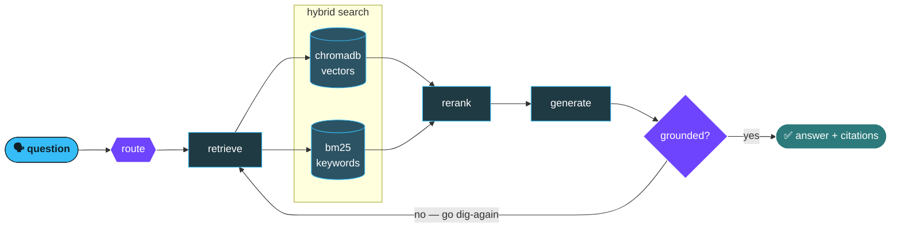

<div align="center">


<a href="https://about---abhishek.vercel.app/"></a>
<a href="https://www.linkedin.com/in/abhishek-tripathi-a714ab30b/"></a>
<a href="https://x.com/Abhishek706577"></a>
<a href="mailto:abhishektripathi317123@gmail.com"></a>


<br/><br/>


</div>

---


```console
$ whoami
Abhishek Tripathi — Kanpur, India. raccoon-adjacent.

$ cat ~/.obsessions
agents that know when they're wrong
retrieval that cites its sources
traces you can actually read at 3am

$ which languages
/usr/bin/python
/usr/bin/typescript
/usr/bin/c++

$ uptime
awake,mostly. shipping since 2024.

$ echo $PHILOSOPHY
an answer without a source is a rumour
guardrails are cheaper than apologies
```

<br clear="right"/>

---

## what happens when you ask my systems a question



The interesting arrow is the one going backwards. A system that can't tell it failed to ground an
answer will happily invent one instead.

---

## and This is what it looks like from the inside

```
trace  a9f2c1   "why was my invoice charged twice?"            1,284 ms
│
├─ router.classify ................ ▇▇ 41 ms          → billing
├─ retrieve.hybrid ............... ▇▇▇▇▇▇ 210 ms
│  ├─ chroma.vector_search ....... ▇▇▇▇ 148 ms        k=12
│  └─ bm25.keyword ............... ▇ 34 ms            k=12
├─ rerank.cross_encoder .......... ▇▇▇ 96 ms          12 → 4 chunks
├─ llm.generate .................. ▇▇▇▇▇▇▇▇ 612 ms    groq · 284 tok
├─ guardrail.groundedness ........ ▇▇ 78 ms           ✓ 4/4 cited
└─ guardrail.pii_scrub ........... ▇ 22 ms            ✓ clean
                                                      ──────────────
                                                      0 retries · ok
```

If you can't produce this for an LLM feature, you don't have a feature. You have a slot machine.

---

## the stack

<details open>
<summary><b>🤖 &nbsp;the part that thinks</b></summary>
<br/>
<p>


</p>
<p>


</p>
</details>

<details open>
<summary><b>🔍 &nbsp;the part that remembers</b></summary>
<br/>
<p>


</p>
</details>

<details open>
<summary><b>📡 &nbsp;the part that watches</b></summary>
<br/>
<p>


</p>
</details>

<details>
<summary><b>🧱 &nbsp;the part users actually touch</b></summary>
<br/>
<p>


</p>
<p>


</p>
<p>


</p>
</details>

---

## currently poking at

<table>
<tr>
<td width="33%" valign="top" align="center">
<h3>🎙️</h3>
<b>voice RAG in hindi</b>
<br/><br/>
<sub>speech in, grounded speech out. the hard part was never the audio — it's proving the claim before you say it out loud.</sub>
</td>
<td width="33%" valign="top" align="center">
<h3>🕸️</h3>
<b>multi-agent handoffs</b>
<br/><br/>
<sub>triage → specialist → escalation. every hop traced, because "the agent decided something" is not a debug log.</sub>
</td>
<td width="33%" valign="top" align="center">
<h3>⚡</h3>
<b>sub-second inference</b>
<br/><br/>
<sub>LLM calls sitting in the render path. if the user notices the model thinking, i've already lost.</sub>
</td>
</tr>
</table>

---

## things i'll argue about

> **"just fine-tune it"**
> usually no. most of the time your retrieval is bad, not your weights.

> **"the demo works"**
> a demo is one lucky path through a system with no error handling.

> **"we'll add logging later"**
> for anything non-deterministic, tracing *is* the feature. bolt it on afterwards and you're guessing.

> **"the model hallucinated"**
> the model did exactly what it was built to do. you shipped it without a verifier.

---

## the contribution dumpster 🦝

<div align="center">


<br/>


<br/><br/>


<br/><br/>


<br/>


</div>

---

<div align="center">

<em>my inbox is open. so is the dumpster.</em>


</div>
